# Life-Expectancy-in-India

## Project Purpose and Description

In this project, I looked at the the various features that influence Life Expectancy in seven states in India.  I analyzed the features to determine if people that tend to come from a certain demographic live a shorter or longer life. I then tested models that would predict average life expectancy.

## Tools (all using Python and its various libraries)
   - Pandas
   - Numpy
   - Seaborn
   - Matplotlib
   - Scikit Learn
   
## Data:
The data used was in the form of a csv from [Kaggle](https://www.kaggle.com/rajanand/mortality).

Over 480,000 individual records pertaining to the death of people in different states in India between the years 2002 and 2012

<ins> Features </ins>

household number, state, district, rural, sex, usual residence, age, marital status, highest qualification status, occupation status, disability status, illness type, chew, smoke, alcohol, owner status, is water filtered, is toilet shared,  does household have electricity, lighting source, cooking fuel, kitchen availability, has refrigerator, is covered by health scheme

## Target

### Age

 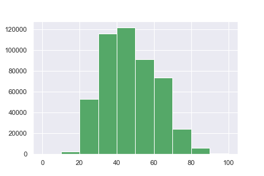

## EDA

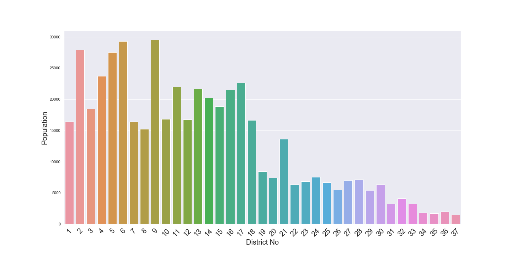

  

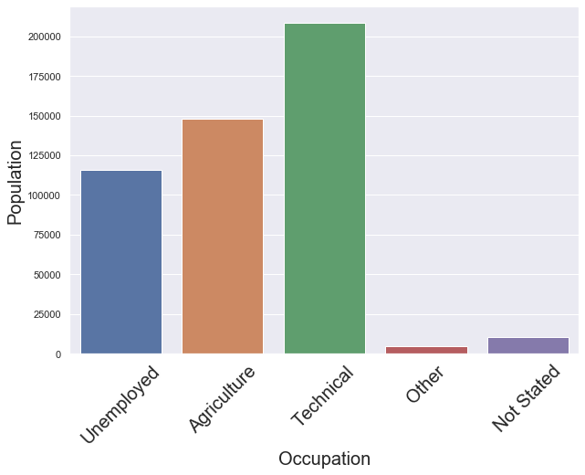

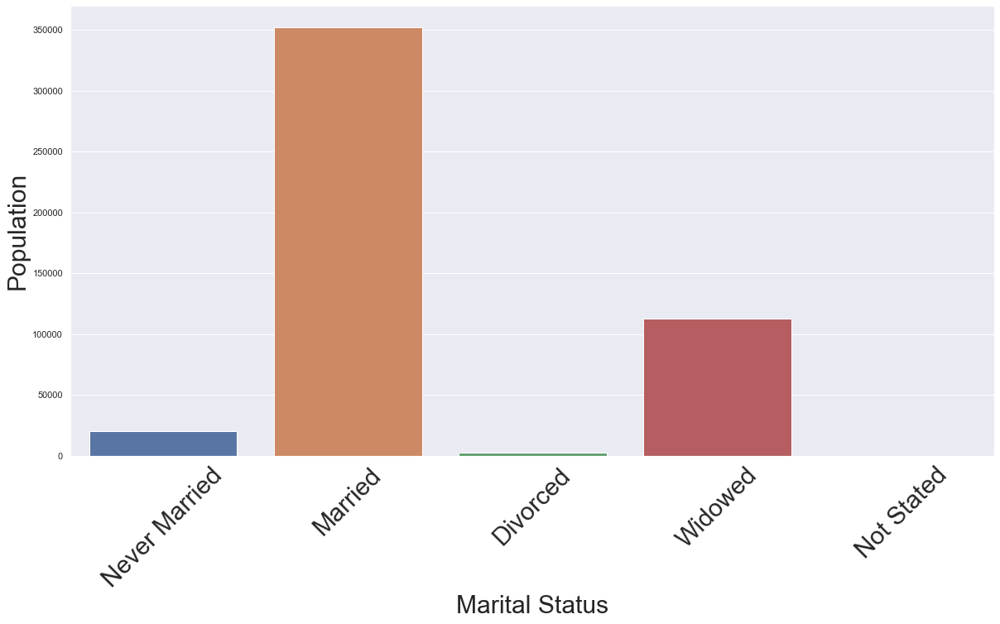

  

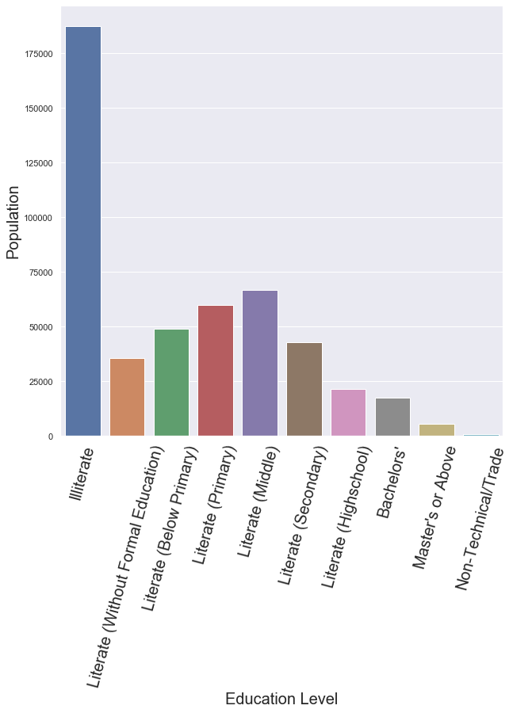

  

 
## Taking a Closer Look at the Data

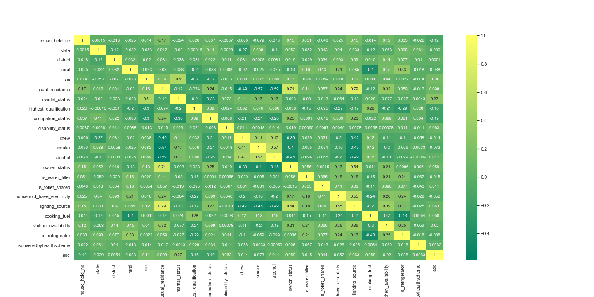

## Modeling

### Is that data a good candidate for regression?

- There's little to no multicolinearity between the features
- The relationship between the features and the outcome in mostly linear
- The residuals are normalized
- The data is homoscedatic 

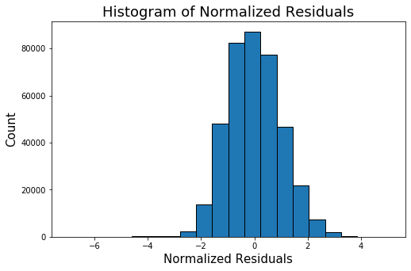

After cleaning the data, examining viewing correlations,  and determining that the dataset was viable for a Linear Regression, I ran a model and achieved an accuracy rate of 32%. 

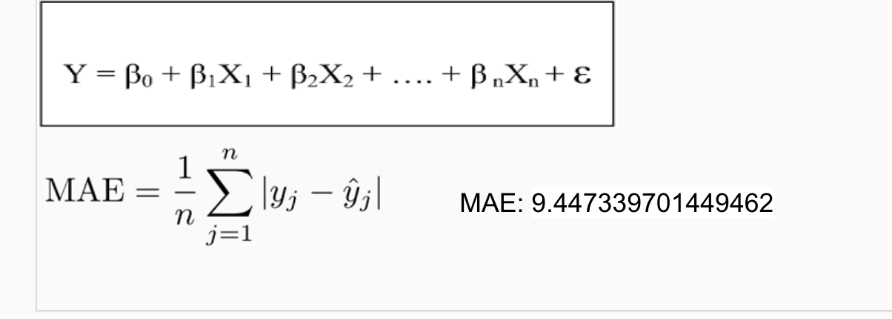

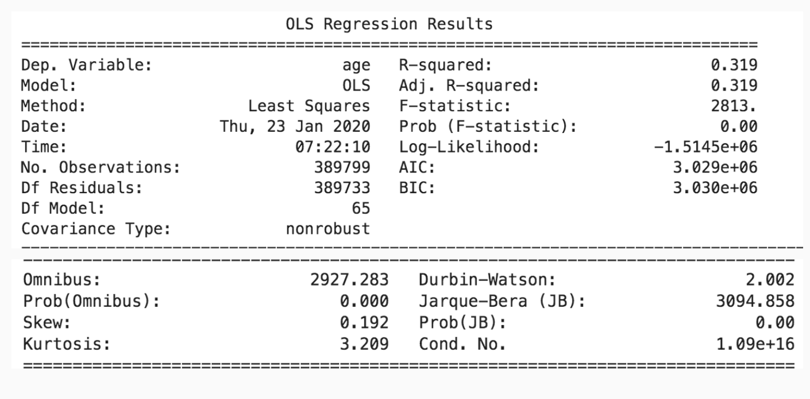

 

## Probability Plot
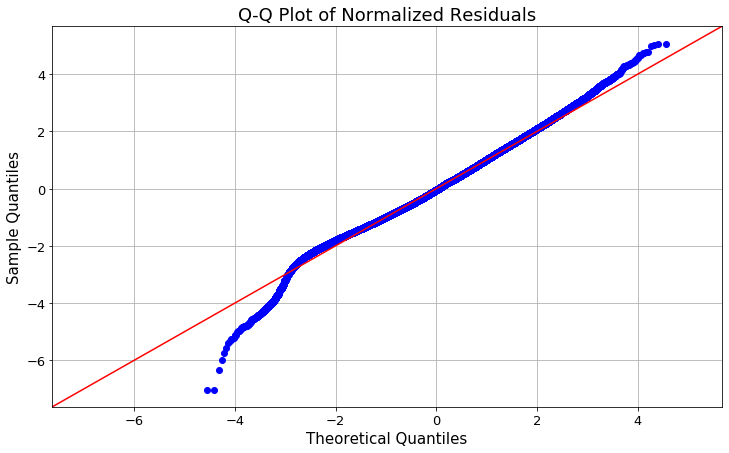

## Conclusion and Future work

In the final model, I achieved an adjusted r-squared value of 32 % using a Linear Regression.  Using the evaluation metric mean absolute error, I was able to pedict the the age of death within 9 years of the actual death. The most significant features were marital status, occupation status, highest qualification.  People who were married, had a job (agricultural, techical or other), and were more educated tended to live longer.  Considerations for the future are to explore what could have led to the deaths of the people from the study and incorporate more continuous features.

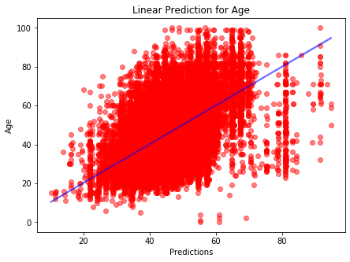

